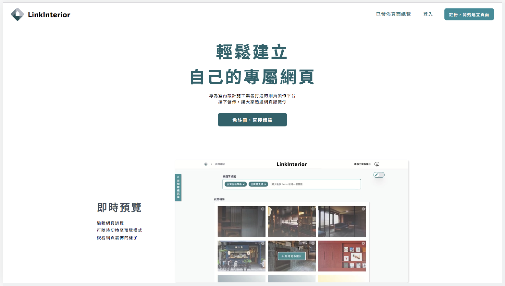
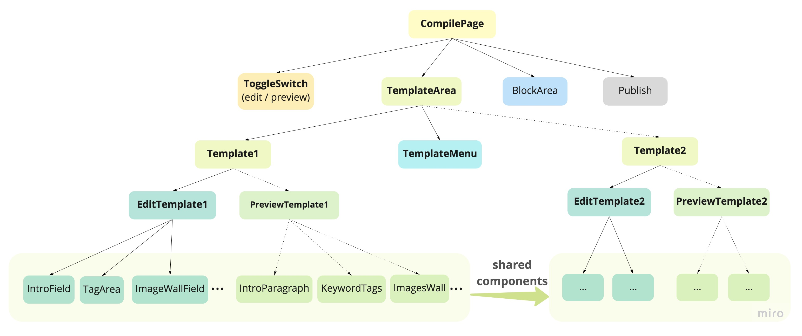
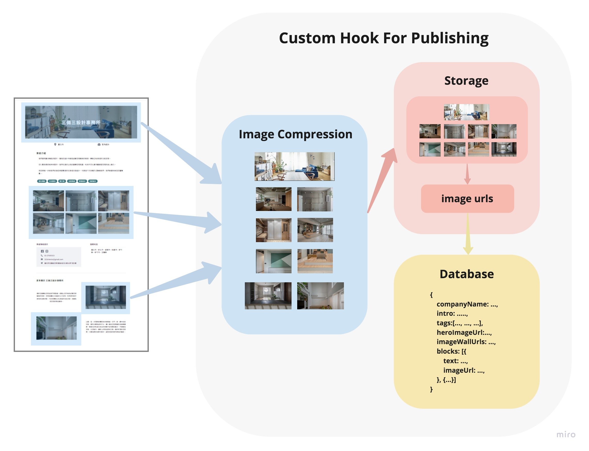
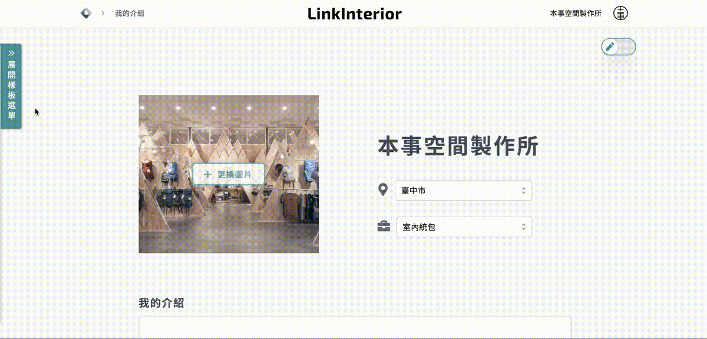

  
   
A webpage builder platform for all kinds of interior services built with React/React context, featuring WYSIWYG user experience. 

<table>
<tr>
<td>
LinkInterior is a webpage builder for interior engineering/design services to publish their own page with real-time edit/preview mode toggle switch, template switch, additional blocks for extended content and one-click publishing features.</td>
</tr>
</table>

  

Demo: https://linkinterior.com.tw/

## Used Skills

| skill                     | description                                                                                                                          |
| ------------------------- | ------------------------------------------------------------------------------------------------------------------------------------ |
| React ( hook )            | SPA, reusable functional components, custom hooks                                                                                    |
| React Router              | SPA, public and private route set up                                                                                                 |
| React Context             | pass data through nested components tree                                                                                             |
| styled-components         | CSS-In-JS library for styling                                                                                                        |
| Tailwind CSS, Tailwind UI | assist accelerate development speed                                                                                                  |
| Third-Party Modules       | [Browser Image Compression](https://www.npmjs.com/package/browser-image-compression), [Swiper](https://www.npmjs.com/package/swiper) |
| Prettier                  | keep coding style consistent and better formatted                                                                                    |
| ESLint                    | enhance development efficiency                                                                                                       |
| Normalize.css             | cross browsers homogeneous style development                                                                                         |
| Firebase                  | Firestore, Storage, Authentication, Hosting for Back-End                                                                             |
| Miro                      | Wireframe Design                                                                                                                     |

 

## Essentail Development Introduction

### React Components Structure Design

Accomplish

- WYSIWYG (edit/preview toggle)
- Real-time Template Switch

by nested components tree & shared components design

### Custom Hook For Page Publishing

Build a custom hook for page publishing procedure

1. compress all images to proper size
2. upload compressed image to Firebase Storage, retrieving URLs of uploaded images
3. create new Firestore Database document with image urls and other data

  

## Features

### WYSIWYG: Real-time Edit/Preview mode toggle

- User can toggle between Edit Mode and Preview Mode any time during their page compiling process
- Preview mode allow user to inspect final publishing result and adjusting accordingly, achieving WYSIWYG user experience.

 

### Real-Time Template Switch

In both Edit and Preview mode, user can switch between different template and decide which one best-presented their webpage.

 

### Extended Page Content Using Block

User can select different types of block and add more image, text content to their own page.

 

### One-Click Publishing

User can publish their own page with simply one-click. Few seconds later, their own page is published and ready for the world to visit.

